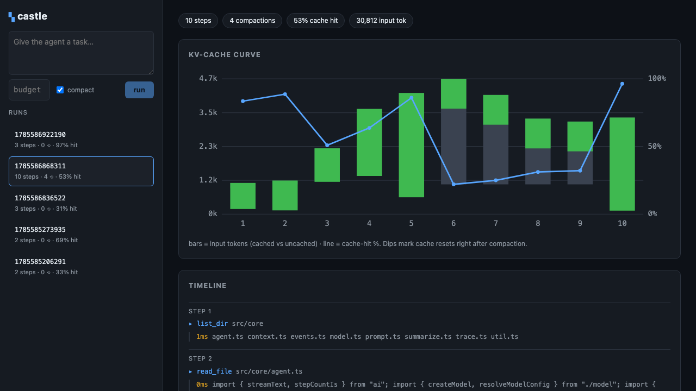
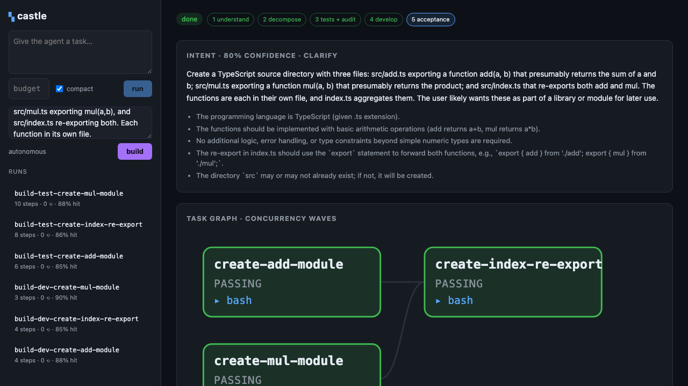
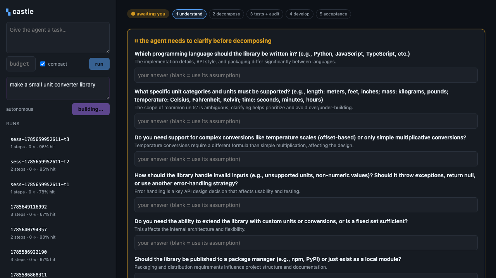

# Castle

A coding-agent **harness** — the scaffolding that turns an LLM into an agent
that can actually work in a repository: an agent loop, a tool layer, context
engineering, tracing, and an eval harness. Built on Bun + TypeScript, driving
DeepSeek's API.

> This is a study of *harness engineering* — the parts of an agent that live
> around the model rather than inside it. The interesting problems are the loop,
> the context window, the tool protocol, and KV-cache economics — not another
> wrapper over a chat endpoint.

**Writeups:** [Notes on building a coding-agent harness](docs/harness-notes.md)
(design decisions + honest limitations) · [Architecture: from one sentence to a
small full-stack app](docs/architecture-full-stack.md) (where this is headed —
contract-first decomposition, the shared-edit protocol, mid-build replanning).

## Status

**P0 + P2 + P4 + P5.** `castle run "<task>"` streams a real think→act→observe loop
against DeepSeek, with a file/bash tool suite, a KV-cache-aware context manager,
and a per-run JSONL trace. `castle trace <file>` reconstructs the token/cache
economics of any run. `castle serve` opens a React dashboard that live-streams a
running agent and charts its KV-cache curve. `castle build "<goal>"` runs a
spec-driven pipeline: understand → decompose → write+audit acceptance tests →
develop in parallel git worktrees → loop until the tests pass. `castle chat` is an
interactive, disk-persisted, resumable multi-turn session. The agent also has
persistent memory, on-demand skills, and a hand-rolled MCP client.



## Quickstart

```bash
bun install
cp .env.example .env      # then paste your DEEPSEEK_API_KEY
bun run bin/castle.ts run "summarize what this project does, then list its source files"
bun run bin/castle.ts trace .castle/traces/<run>.jsonl    # analyze a run
bun run bin/castle.ts serve                               # web dashboard on :3000
```

Flags: `--model <id>` (default `deepseek-chat`), `--max-steps <n>`,
`--context-budget <tokens>`, `--no-compact`, `--dry-run`.

## Architecture

The core is intentionally **presentation-free and SDK-isolated**. The agent loop
is the only code coupled to the model SDK; everything upstream speaks one
`AgentEvent` stream, so the terminal renderer, the web dashboard, and the eval
runner are all just consumers of the same events.

```
src/
├── core/
│   ├── agent.ts      # the agent loop → AsyncGenerator<AgentEvent>
│   ├── events.ts     # AgentEvent union + token accounting (KV-cache aware)
│   ├── model.ts      # DeepSeek via the OpenAI-compatible Chat Completions API
│   ├── prompt.ts     # the static, cache-stable system prefix
│   ├── context.ts    # context manager: budget, turn-safe compaction
│   ├── summarize.ts  # model-backed summarizer used by compaction
│   ├── analysis.ts   # fold an event stream → run metrics (CLI + web share it)
│   ├── subagent.ts   # context-isolated subagents: think() + work()
│   ├── memory.ts     # persistent per-project agent memory
│   ├── skills.ts     # progressive-disclosure skill catalogue
│   ├── mcp.ts        # hand-rolled MCP stdio client (JSON-RPC)
│   ├── session.ts    # persisted multi-turn conversations (resumable)
│   └── trace.ts      # append-only JSONL tracer (one file per run)
├── tools/            # bash · read/write/edit/list · remember · load_skill
├── build/            # spec-driven pipeline: schemas · graph · worktree · orchestrator
├── server/           # Bun.serve: JSON API + WebSocket live-run streaming
├── render.ts         # terminal renderer for the event stream
└── commands/         # run · chat · sessions · trace · serve · build
web/                  # React dashboard (hand-rolled SVG cache chart, no chart dep)
```

### Design notes

- **The loop is a seam, not a black box.** `runAgent` consumes the SDK's raw
  stream and re-emits harness events. Swapping the model or the frontend never
  touches the other side.
- **KV cache is a first-class metric.** `Usage` surfaces `cachedInputTokens`, and
  the system prompt is kept a byte-stable prefix so prompt-prefix cache hits are
  possible at all. Every run prints its cache-hit rate.
- **Tool output is bounded.** A noisy command can't blow up the context window;
  output is truncated with an explicit marker.

## Context engineering (P2)

Two independent levers, kept distinct on purpose:

**Lever A — a cache-stable prefix.** Under budget, the context manager returns the
message window *untouched*. Nothing earlier is rewritten, so the prompt prefix is
byte-identical to the previous step and DeepSeek's prefix cache hits on it. The
system prompt is deliberately static for the same reason.

**Lever B — turn-safe compaction.** When the estimated window exceeds a token
budget, the manager pins the task and the most recent turns, and replaces the
middle with a model-written summary. Compaction only ever cuts on *turn*
boundaries, so an `assistant` tool call and the `tool` results it produced always
move together — never a dangling tool result. This bounds the window on long runs
at the cost of a one-time cache reset.

These pull in opposite directions, and the harness measures the trade-off rather
than hiding it. A real 10-step run (`--context-budget 2500`), read back with
`castle trace`:

```
  step   input   cached   hit%    output
     1    1073      896    84%        44
     2    1155     1024    89%        47     ← append-only: prefix cache hits
     5    4166     3584    86%        48
     6    4652     1024    22%        49     ← cache reset right after a compaction
     7    4098     1024    25%        52
    10    3321     3200    96%       135

  compactions:
    ⟲ 2 turns · 4289 → 3313 tokens
    ⟲ 2 turns · 3688 → 2386 tokens
  total: input=30812 cached=16256 (53% hit)
```

Input tokens plateau around 3–4k instead of growing unbounded with step count
(the win from Lever B); cache-hit stays high while appending and dips right after
each compaction (the cost of Lever B, and the reason Lever A leaves history
alone whenever it can). Toggle it with `--no-compact` to see the window grow.

## Dashboard (P4)

`castle serve` starts a `Bun.serve()` app (no Vite; HTML imports bundle the React
frontend) with three surfaces:

- a JSON API over recorded traces (`/api/runs`, `/api/runs/:id`),
- a **WebSocket that live-streams a running agent**, and
- a React UI that charts the per-step KV-cache curve and renders the timeline.

The point is the seam: the browser consumes the *same* `AgentEvent` stream the
terminal renderer does, and both the live view and the historical view fold that
stream through one `summarizeEvents()` — so a run looks identical whether it's
watched in real time or replayed from disk. The cache chart is hand-drawn SVG
(cached vs uncached tokens per step, hit-% line on top), no chart dependency.

## Spec-driven build (P5)

`castle build "<goal>"` is an orchestration layer over the single agent loop. Its
premise: **the loop terminates when acceptance tests pass, not when the model says
it's done.** Five phases:

1. **Understand** — expand a vague goal into a precise intent; *pessimistically*
   ask the user to confirm when confidence is low (or `--yes` to proceed on
   logged assumptions).
2. **Decompose** — break it into atomic, testable tasks with a dependency graph;
   `toWaves()` turns the DAG into parallel waves.
3. **Acceptance tests + audit** — a subagent writes tests (TDD, red first); then a
   **context-isolated auditor** — a fresh subagent that never saw the test-writer's
   reasoning — judges whether they really verify the criteria or could false-pass.
4. **Develop** — each task builds in its own **git worktree**, tasks in a wave run
   in parallel, branches merge back (disjoint files → clean merges).
5. **Acceptance** — run the tests; failing tasks get bounded fix attempts; whatever
   still fails is reported honestly, not hidden.

This is where the harness's **Subagent / Multi-Agent / Planning** live. Subagents
(`src/core/subagent.ts`) are the unit of context isolation: `think()` for
structured one-shot calls, `work()` for full agentic sub-runs. The auditor's
isolation is the point — the agent can't mark its own homework.

A real autonomous run (`castle build "…string-utils library…" --yes`) decomposed
into 4 tasks / 2 waves, wrote and audited acceptance tests, developed 3 tasks in
parallel worktrees, merged, and passed 4/4 acceptance (independently re-verified
with `bun test`: 21 pass).

The whole pipeline also streams to the dashboard over a WebSocket (`/ws/build`):
the orchestrator emits a `BuildEvent` stream that lights up a live task DAG —
columns are concurrency waves, nodes colour by state (testing → developing →
merged → passing), edges are dependencies. Same "emit events, many consumers"
discipline as the agent loop; the CLI renderer and the browser fold the same
stream. Every subagent also writes its own trace, so each node's KV-cache curve
is one click away in the runs list.



The auditor is a **gate, not a comment**: when it flags tests as weak or
false-passable, they're sent back to a fresh test-writer with the specific issues,
re-audited, and only then accepted (`--audit-attempts`).

### Recursive decomposition + human-in-the-loop

Decomposition is **recursive**: each node is expanded until it's atomic (or a
depth cap), producing a task *tree* whose leaves are the executable DAG (deps are
wired in a second pass over the leaves). Ids are prefixed by parent, so a goal
like "a unit converter" becomes `root-setup-project`, `root-implement-core`, …

On the dashboard the pipeline is **interactive** — the WebSocket is bidirectional
and the orchestrator pauses at two checkpoints, awaiting you:

1. **Clarify.** Minimal input in, proactive questions out. Before decomposing, the
   agent asks what's ambiguous (language, scope, error handling…), each with its
   rationale, and waits for your answers.
2. **Approve the plan.** After decomposition, the DAG renders and **no code is
   written until you approve it.**

Development, tests, and acceptance then run with no further interruption. Each
build is persisted to `.castle/builds/<id>.json` as it progresses. (Full
structural DAG editing and click-a-node status are the next steps; today the
checkpoint is answer-and-approve.)



## Memory, skills, MCP

Three ways the harness augments the agent's context, all loaded once at run start
so they sit in the stable prompt prefix:

- **Memory** (`.castle/memory.md`) — persistent per-project notes. Loaded into the
  system prompt; the agent appends to it with the `remember` tool. Survives across
  runs, so a fact learned once is there next time.
- **Skills** (`.castle/skills/*.md`) — named instruction bundles with frontmatter.
  Only their *names and descriptions* sit in context; the full body loads on
  demand via `load_skill`. Progressive disclosure keeps always-on context small.
- **MCP** (`.castle/mcp.json`) — a hand-rolled Model Context Protocol client over
  stdio (newline-delimited JSON-RPC: `initialize` → `tools/list` → `tools/call`).
  Each server's tools are proxied into the registry as `mcp__<server>__<tool>`, so
  to the loop an MCP tool is just another tool.

Verified in one run: the agent called an `mcp__demo__echo` tool, `load_skill`-ed a
skill and followed it, and `remember`-ed a fact that persisted to disk.

## Interactive sessions

`castle chat` is a multi-turn conversation, not a one-shot task. The whole message
history (user, assistant, tool) is **persisted to disk** at
`.castle/sessions/<id>.json` after every turn, so a session survives the process
and resumes with `--continue` (or `--resume <id>`); `castle sessions` lists them.

Dependencies — model, tools, MCP connections, and the memory/skills-augmented
system prompt — are built once per session and reused across turns, so the prompt
prefix stays stable and the KV cache stays warm turn to turn.

The refactor that made this possible is small: `prepareAgent()` builds the
per-session deps once, and `streamMessages()` streams one turn over the running
history and returns the messages it generated. `castle run` is now just the
one-shot special case (a single turn over `[user(task)]`); `ChatSession` loops it.

Verified end-to-end across a process restart: turn 1 stated a fact, turn 2
computed with it (`bash echo $((42*2))` → 84), then a **fresh process** resumed
with `--continue` and turn 3 still recalled the fact — cache-hit climbing 78% →
98% → 96% across turns as the stable prefix pays off.

## Roadmap

| Phase | Focus |
|-------|-------|
| **P0** ✅ | Agent loop, tool suite, streaming, per-run trace |
| **P2** ✅ | Context engineering: turn-safe compaction, KV-cache-stable prefixes, `castle trace` measurement |
| **P4** ✅ | `Bun.serve` API + WebSocket live-run + React dashboard with SVG cache chart |
| **P5** ✅ | `castle build`: subagents, context-isolated test audit (revise-loop gate), worktree parallel dev, acceptance-gated loop |
| **P5+** ✅ | Persistent memory, progressive-disclosure skills, hand-rolled MCP stdio client |
| **P7** ✅ | Interactive multi-turn `castle chat`: disk-persisted, resumable sessions |
| **P8** ✅ | Recursive decomposition (task tree → leaf DAG) + HIL checkpoints (clarify + approve-plan) over a bidirectional WS; builds persisted to disk |
| P8+ | Full structural DAG editing + click-a-node agent status (view) |
| P1 | Tool permissions & risk model, richer file tools |
| P3 | Textual-style TUI, steering & interruption |
| P6 | Eval harness on real tasks (success rate / tokens / cost / cache hit) |

## Development

```bash
bun test            # unit tests (tools, usage mapping, truncation)
bun run typecheck   # tsc --noEmit
```
